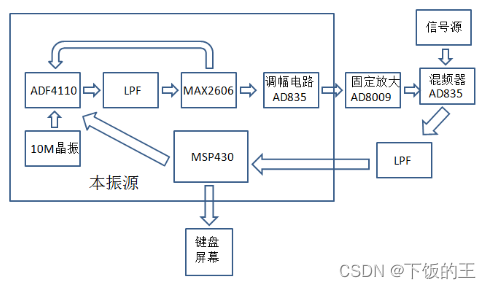
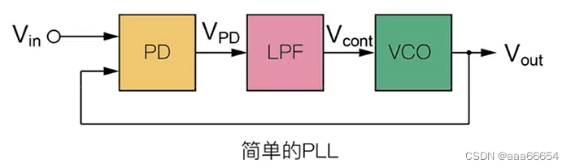
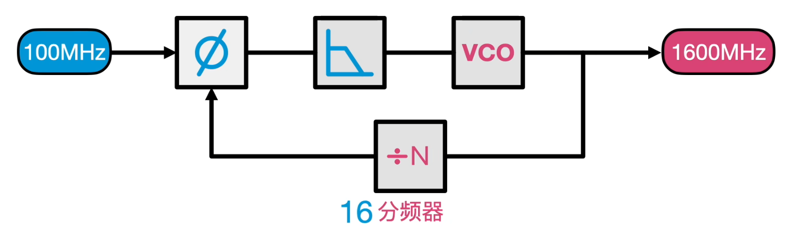
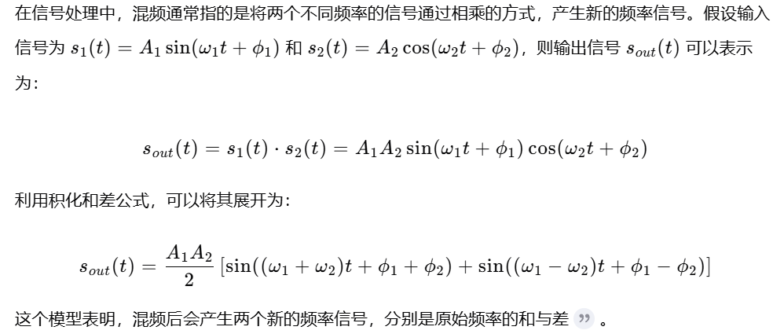
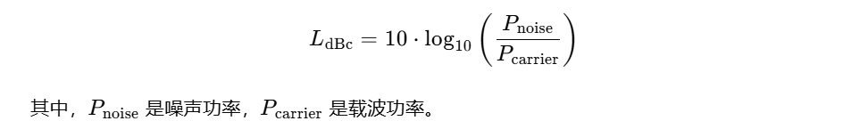

# 高稳定性的本振源模块
- 理论：锁相环频率合成/相位噪声分析
- 电路：ADF4351+环路滤波器设计（三阶无源）
- 测试：相位噪声（< -90dBc/Hz@10kHz）、锁定时间（< 100μs）
- 应用：超外差接收机本振、QPSK调制载波源

## 本振源的功能
- 本振源是指在无线电通信系统中产生稳定本地振荡信号的电路模块  
- 本地振荡信号用于与接收到的射频信号进行混频，实现频率的转换，从而将射频信号下变频到中频或基带，便于后续的信号处理和解调   
- 本振源与晶振很像，都用于产生稳定的振荡信号，只不过晶振产生的是时钟信号（低频方波，范围从几kHz到几百MHz），而本振源产生的是射频振荡信号（高频正弦波，范围很广，可以从几十MHz到几百GHz）  
- [2015E题](https://wusiyuan.blog.csdn.net/article/details/119964701)

## 锁相环

- 压控振荡器 (VCO): 就像一个需要控制速度的赛跑选手，它产生我们需要的本振频率，但自身频率会漂移
- 鉴相器 (PD): 就像裁判，它不断比较领跑员和赛跑选手的“相位差”（可以简单理解为位置差距），并告诉选手跑快了还是跑慢了
- 环路滤波器 (LF): 就像教练，它根据裁判的指示，平滑地调整选手的速度，避免速度忽快忽慢
- 分频器 (Divider): 为了得到更高的输出频率，可以在VCO输出端加入分频器
- VCO 产生一个初始频率信号，鉴相器比较 VCO 输出信号（或分频后的信号）与参考频率信号的相位差，
环路滤波器将鉴相器输出的相位误差信号进行滤波处理，得到一个控制电压，这个控制电压被送到 VCO，
改变 VCO 的振荡频率，使其逐渐向参考频率靠拢，经过不断调整，VCO 输出频率最终会“锁定”在参考频率上，相位差也变得很小，达到稳定状态
- 有个可以帮助做锁相环仿真设计的软件叫ADIsimPLL
## 频率可调
- 分频器：在PLL中，分频器是实现频率合成的关键。通过改变分频器的分频比(N)， 
就可以改变VCO输出频率与参考频率之间的关系，从而实现频率可调
- 如何控制分频比 (N) 实现频率可调？
- 数字控制：现代PLL芯片(例如ADF4351)通常采用数字控制的方式来设置分频比N。
分频比N的值存储在芯片内部的寄存器中，ADF4351 等芯片通常提供SPI接口，用于配置芯片内部的寄存器。
通过使用微控制器向SPI接口发送指令，就可以写入不同的数值到分频比寄存器，改变分频比N，从而改变输出频率。
MCU可以预先存储不同的频率值，或者根据用户的输入(例如按键、旋钮、上位机软件)动态计算并设置分频比。
- 模拟控制：一些早期的PLL芯片(例如AD9850)采用模拟控制的方式来设置分频比N。
分频比N的值通过一个模拟电压来控制，这个电压被送到分频器的输入端，改变分频器的输出频率。
这种方式的缺点是分频比N的精度和稳定性较差，且需要额外的模拟电路来实现。

## 混频

通过滤波我们可以得到我们想要的频率的信号，在保留信号的幅度信息的同时，将信号的频率变化到我们想要的频率

## 中频
- 中频是混频后产生的固定频率：在频谱仪和超外差接收机中，中频(IF)是指输入信号与本振信号混频后，通过滤波器选取的固定频率。
之所以称为 "中频"，是因为它通常比输入信号频率低，但又比基带信号频率高。
- 频谱仪的中频是固定的：频谱仪通常会 预先设定一个或多个固定的中频值。例如，常见的频谱仪中频有10.7MHz、21.4MHz、70MHz等。
- 为什么中频是固定的？固定中频使得我们可以使用固定频率的、高性能的中频滤波器。
设计固定频率的滤波器比设计可变频率的滤波器更容易，且性能更好(例如，可以实现更陡峭的滤波特性，更高的选择性)

## 扫描时间
-  频谱分析仪中本振源并不锁定在一个固定频率，
而是要利用本振源的频率可调性，配合混频和滤波，实现对不同频率信号的分析（其实就是分析幅度）
- 与超外差接收机对比：超外差接收机通常本振频率是固定的，用于接收和解调特定频率的信号

## 步进精度
- 本振源的步进精度是指本振源在频率调整过程中，每次频率变化的最小增量，决定了本振源在频率扫描或跳频过程中能够达到的频率分辨率。

## 锁定时间
- 锁定时间是指从PLL启动或频率切换开始，到输出信号与输入信号的频率和相位完全同步所需的时间，
在锁定状态下，PLL的输出信号与输入信号的频率和相位保持一致，误差在允许范围内
- 虽然 1ms 和 2ms 看起来差别不大，但在高频率、快速频率切换的应用中， 
1ms 的差距也可能带来明显的性能差异。例如，如果频谱仪的扫描步进为100kHz，锁定时间为2ms，
那么每个频率点的扫描时间至少为2ms， 扫描整个20MHz频段(200个频率点)就需要400ms， 
如果锁定时间缩短到 1ms， 扫描时间就可以缩短到 200ms

## 相位噪声
- “-90dBc/Hz@10kHz”的意思：在距离载波频率10kHz的位置，单位带宽内的噪声功率与载波功率的比值为-90dBc，
也就是说，噪声功率比载波功率低90dB。这个数值越小，说明相位噪声越小，信号质量越好
- 载波频率：传递信号的频率（我们想留住的频率）
- dBc：

- 可以用一阶滤波器的截止频率简单的理解 锁定时间VS相位噪声：$$ f_c=\dfrac{1}{2 \pi RC} $$  
$f_c$越大，时间常数RC越小，锁定时间越短，但是同时频率噪声滤得也更不干净

## 开源
- [两通道20M到9.8G](https://oshwhub.com/z_star/pocket-rf-clock-source)
- [35M到4.4G](https://oshwhub.com/xiaoyunt/high-speed-adc-acquisition-card)
- [这个只有原理图没有PCB](https://oshwhub.com/123123123ASDASD/ben-zhenadf43510)