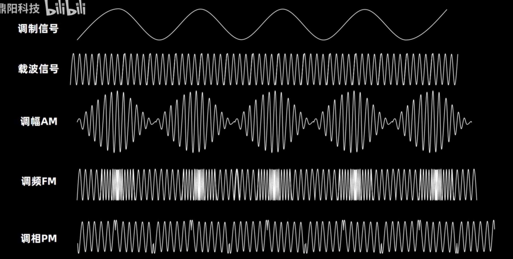
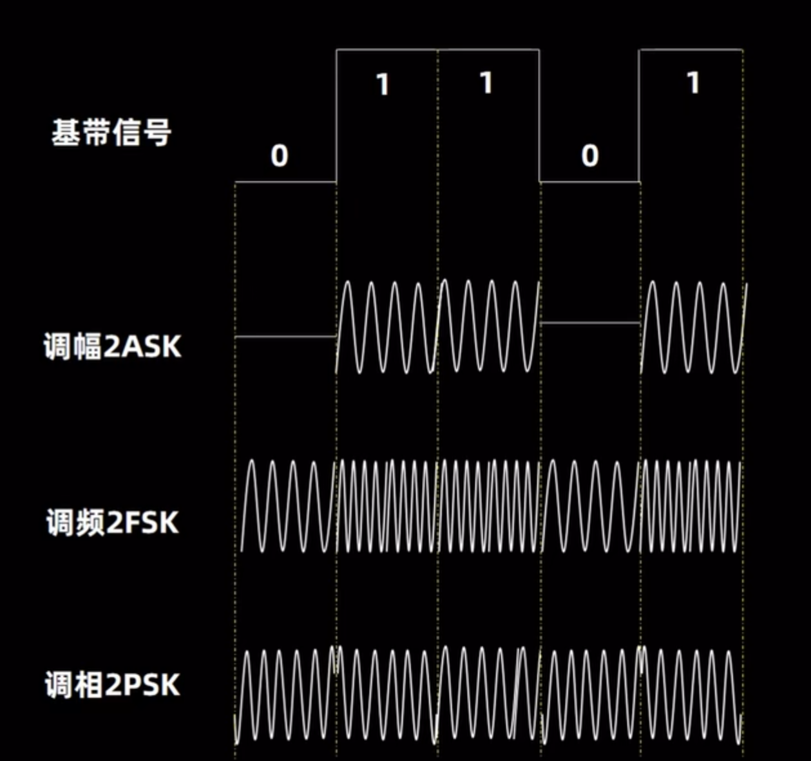
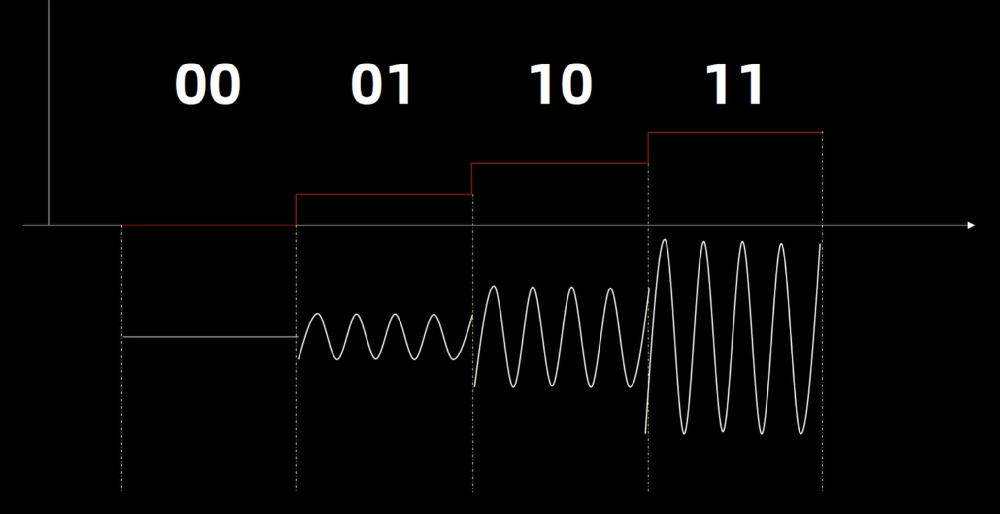
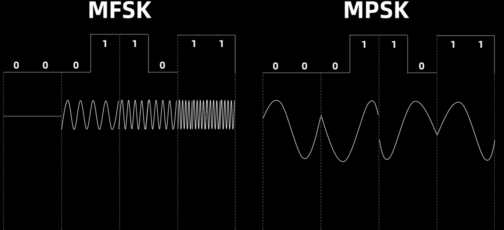
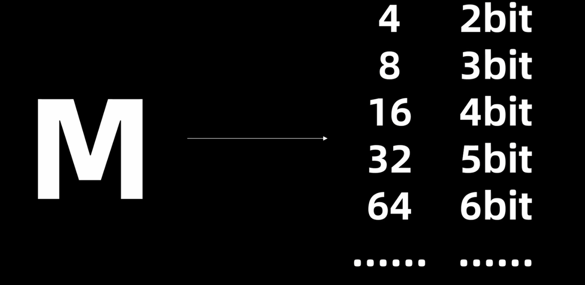
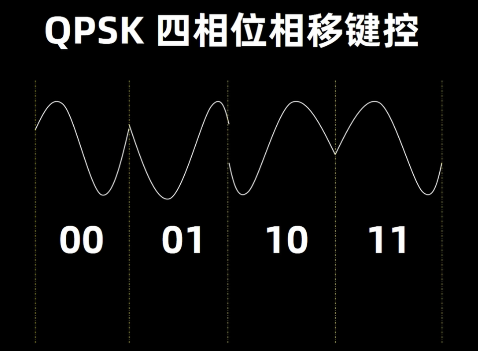
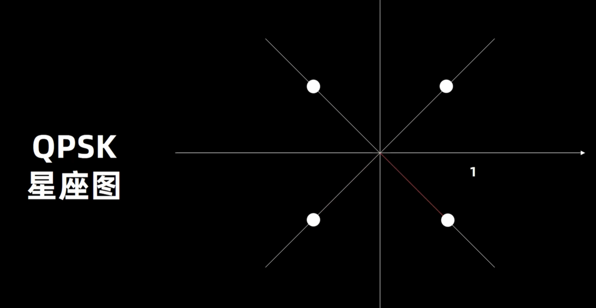
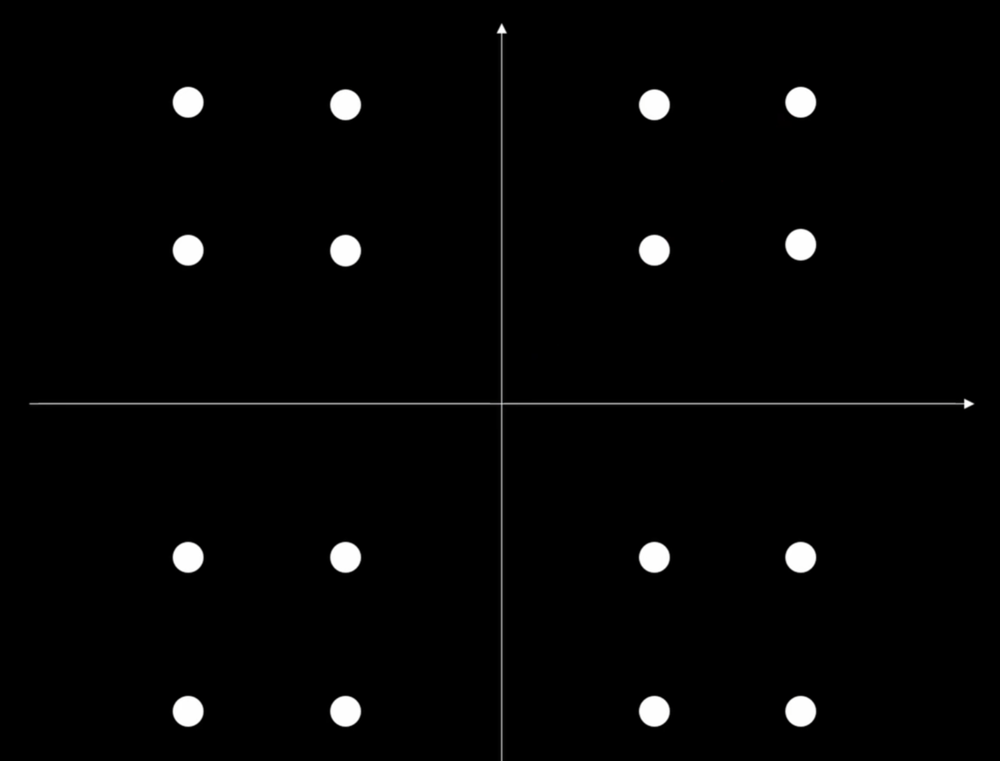

## 调制
- 模拟调制

- 数字调制

  - MASK
  
  - MFSK和MPSK
  
  
  - QPSK（4PSK）应用最广泛
  
    - 星座图（相位角度）
    
  - QAM正交振幅调制（调相同时进行调幅，QPSK就是最简单的QAM，QAM扩展性极好，可以扩展到4096-QAM）星座图
  
## SDR（软件可定义无线电）
- 非SDR
  - 使用MCU进行控制和一些处理，但对于无线电通信中的高频、实时信号处理任务，MCU通常太慢，
  - 缺乏FPGA的并行处理能力。仍然需要用模拟或分立数字组件实现专用硬件电路（混频器、滤波器、调制器/解调器），
  更改无线电的行为将涉及重新设计这些硬件电路。
- SDR
  - 使用FPGA作为核心处理单元，在FPGA的可编程硬件结构上运行的软件（HDL代码）中实现信号处理算法（调制、解调、滤波等）。
  - 可以重新编程FPGA以更改无线电的行为、通信协议或频段，从而提供更大的灵活性。外部电路主要用于RF前端和数据转换（ADC/DAC）
  - 完全用FPGA实现
    - 高频信号处理（如>100MHz）需要并行流水线处理能力，传统MCU的串行架构无法满足实时性要求
    - FPGA支持动态修改硬件逻辑（如切换调制方式、调整滤波器参数），这是固定架构无法实现的

- 思考：
  - 学习曲线陡峭，是否冒险
  - 使用何种FPGA
  - 保留哪些外围电路